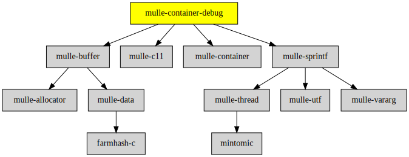

# mulle-container-debug

#### 🛄 Debugging support for mulle-container


| Release Version                                       | Release Notes  | AI Documentation
|-------------------------------------------------------|----------------|---------------
|  [](//github.com/mulle-core/mulle-container-debug/actions) | [RELEASENOTES](RELEASENOTES.md) | [DeepWiki for mulle-container-debug](https://deepwiki.com/mulle-core/mulle-container-debug)


## Info

This repository is home to the various `describe` functions of mulle-container.
Currently there is only one data structure supported and that is
`mulle-pointerarray`. Support for the other data structures is just a matter
of time.

> #### Why is this in mulle-core ?
>
> It's based on mulle-buffer and mulle-sprintf. As mulle-sprintf uses mulle-thread,
> this repository doesn't belong in mulle-c. The describe methods are super simple
> to implement with mulle_buffer_sprintf though.
>


### You are here




## Add

**This project is a component of the [mulle-core](//github.com/mulle-core/mulle-core) library. As such you usually will *not* add or install it
individually, unless you specifically do not want to link against
`mulle-core`.**


### Add as an individual component

Use [mulle-sde](//github.com/mulle-sde) to add mulle-container-debug to your project:

``` sh
mulle-sde add github:mulle-core/mulle-container-debug
```

To only add the sources of mulle-container-debug with dependency
sources use [clib](https://github.com/clibs/clib):


``` sh
clib install --out src/mulle-core mulle-core/mulle-container-debug
```

Add `-isystem src/mulle-core` to your `CFLAGS` and compile all the sources that were downloaded with your project.


## Install

Use [mulle-sde](//github.com/mulle-sde) to build and install mulle-container-debug and all dependencies:

``` sh
mulle-sde install --prefix /usr/local \
   https://github.com/mulle-core/mulle-container-debug/archive/latest.tar.gz
```

### Legacy Installation

Install the requirements:

| Requirements                                 | Description
|----------------------------------------------|-----------------------
| [mulle-c11](https://github.com/mulle-c/mulle-c11)             | 🔀 Cross-platform C compiler glue (and some cpp conveniences)
| [mulle-buffer](https://github.com/mulle-c/mulle-buffer)             | ↗️ A growable C char array and also a stream - on stack and heap
| [mulle-container](https://github.com/mulle-c/mulle-container)             | 🛄 Arrays, hashtables and a queue
| [mulle-sprintf](https://github.com/mulle-core/mulle-sprintf)             | 🔢 An extensible sprintf function supporting stdarg and mulle-vararg

Download the latest [tar](https://github.com/mulle-core/mulle-container-debug/archive/refs/tags/latest.tar.gz) or [zip](https://github.com/mulle-core/mulle-container-debug/archive/refs/tags/latest.zip) archive and unpack it.

Install **mulle-container-debug** into `/usr/local` with [cmake](https://cmake.org):

``` sh
cmake -B build \
      -DCMAKE_INSTALL_PREFIX=/usr/local \
      -DCMAKE_PREFIX_PATH=/usr/local \
      -DCMAKE_BUILD_TYPE=Release &&
cmake --build build --config Release &&
cmake --install build --config Release
```


## Author

[Nat!](https://mulle-kybernetik.com/weblog) for Mulle kybernetiK  


